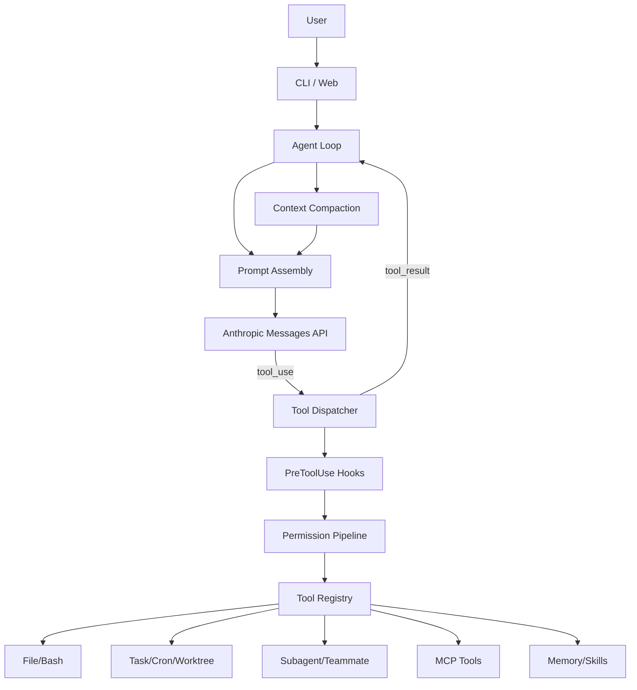

# CodeAgent-Harness

CodeAgent-Harness 是一个从 `learn-claude-code` s20 综合示例重构而来的教学型 Coding Agent Harness。原始 s20 将工具分发、权限系统、Hook、Todo、子 Agent、Skill、上下文压缩、Memory、错误恢复、任务图、后台任务、Cron、团队协作、Worktree 与 MCP 放在一个单文件循环中；本项目将这些机制拆成可维护的 Python 包结构，便于继续扩展、演示和写进实习简历。

## 项目亮点

- **Agent Loop**：实现 `LLM -> tool_use -> tool_result -> LLM` 的闭环执行。
- **Tool Registry**：统一管理 Bash、文件读写、Todo、Task、Cron、Worktree、MCP 等工具。
- **Permission Pipeline**：在工具执行前统一拦截危险命令和越权路径。
- **Hook System**：支持 `UserPromptSubmit / PreToolUse / PostToolUse / Stop` 四类扩展点。
- **Memory & Skill**：支持 `.memory/MEMORY.md` 索引、单条 Markdown 记忆文件、相关记忆注入、轮后记忆抽取/整理，以及 `skills/*/SKILL.md` 动态加载。
- **Context Compaction**：对超大工具输出持久化、对历史消息裁剪并进行摘要压缩。
- **Task Graph & Worktree**：支持任务依赖、任务认领、任务完成、Git worktree 隔离开发。
- **Background & Cron**：慢命令可转入后台，Cron 定时任务会重新注入 Agent Loop。
- **Multi-Agent Protocol**：支持 teammate、message bus、计划审批和关闭请求。
- **Mock MCP**：提供 docs/deploy 两个教学型 MCP Server，用于演示外部工具发现。

## 目录结构

```text
CodeAgent-Harness
├── README.md
├── docs/
│   ├── architecture.md
│   ├── permission.md
│   └── demo.md
├── codeagent/
│   ├── core/        # Agent Loop、配置、LLM 调用、上下文压缩、CLI
│   ├── tools/       # 工具定义、分发、Bash/文件/Todo/Skill
│   ├── hooks/       # Hook 管理器与默认权限 Hook
│   ├── memory/      # 本地 Memory 与 Skill Registry
│   ├── tasks/       # Task Store、Worktree、Cron、后台任务
│   ├── agents/      # Subagent、Teammate、MessageBus、Protocol
│   └── mcp/         # MCP Client 与 Mock Servers
├── web/             # Streamlit 可视化界面
├── tests/
├── config.example.yaml
└── requirements.txt
```

## 快速开始

```bash
cd CodeAgent-Harness
python -m venv .venv
# Windows: .venv\Scripts\activate
source .venv/bin/activate
pip install -r requirements.txt
cp config.example.yaml config.yaml
```

创建 `.env`：

```env
ANTHROPIC_API_KEY=your_key_here
MODEL_ID=claude-sonnet-4-20250514
# 可选
FALLBACK_MODEL_ID=claude-3-5-haiku-20241022
ANTHROPIC_BASE_URL=
```

运行 CLI：

```bash
python -m codeagent
```

运行可视化界面：

```bash
streamlit run web/app.py
```

运行测试：

```bash
pytest -q
```

## 架构图



## 可写进简历的项目描述

**CodeAgent-Harness：面向软件工程自动化的 Coding Agent 执行框架**

- 基于 Anthropic Messages API 设计并实现 Coding Agent Harness，构建工具调用、权限校验、上下文压缩、任务调度、多 Agent 协作与 MCP 扩展能力。
- 将单文件教学代码重构为分层 Python 包，按 Core、Tools、Hooks、Memory、Tasks、Agents、MCP 拆分职责，提升可维护性与可扩展性。
- 实现统一 Tool Registry 与 Hook Pipeline，在 Bash、文件读写、Worktree、部署类 MCP 工具执行前进行安全拦截与审计日志记录。
- 支持 Task Graph、后台任务、Cron Scheduler 与 Git Worktree 隔离开发，模拟真实 Coding Agent 的长任务执行和团队协作流程。
- 提供 Streamlit 可视化界面与 pytest 基础测试，便于演示 Agent 状态、任务列表、定时任务和内存文件。

## 与原始 s20 的关系

原始 s20 的定位是“把所有教学组件合并回一个 loop”的最终章节；本项目保留其核心机制，并按工程化职责拆分，方便后续继续接入真实 MCP Server、前端 Dashboard、权限策略配置和更完整的测试集。
